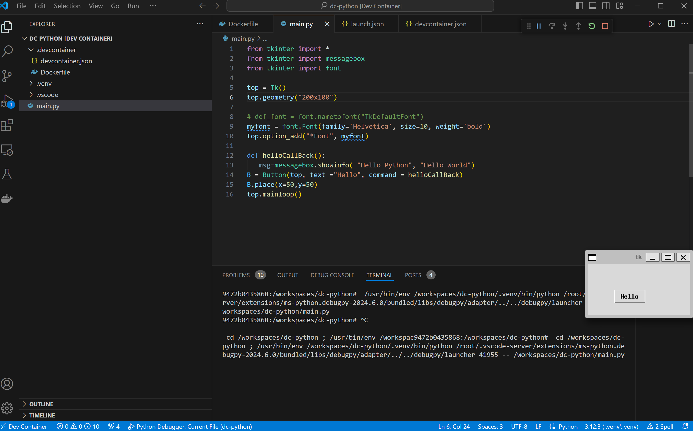

# Setup for Devcontainer for Python and Tkinter GUI development on Windows

Prerequisities:
- Docker desktop, I used v. 4.30
- VcXsrv, I used v. 1.20.14.0
- VSCode, I used 1.89.1
- VSCode Extensions 
  - Remote development, I used v0.25.0
  - Dev Containers, I used v0.362.0
  - Python

The app is using Alpine container, installs xvfb, Python 3.12 and tkinter and activates a local venv.
The devcontainer's container is automatically configured with X11 Display, so it is not needed in configuration.

The Windows remote X server client [VcXsrv](https://sourceforge.net/projects/vcxsrv/) needs to be installed and started.

The result:

